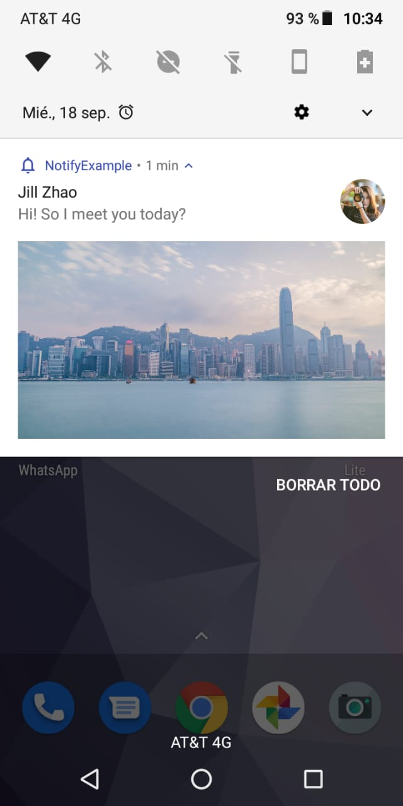

# Notify-Android
[](https://jitpack.io/#isradeleon/Notify-Android)
[](https://android-arsenal.com/api?level=19#l19)
[](https://android-arsenal.com/api?level=28#l19)

Android library that simplifies showing system notifications. Use a circle image for the large icon or add
a big picture to the notification using a single Notify object.

<p align="center">
    
</p>

## Installation

Add jitpack.io to your root build.gradle:
```gradle
allprojects {
    repositories {
        ...
        maven { url 'https://jitpack.io' }
    }
}
```

Finally add the dependency to your app build.gradle:
```gradle
dependencies {
    implementation 'com.github.isradeleon:Notify-Android:1.0.3'
}
```

## Notification channel for API >= 26

You'll need to add the default notification channel to your app/res/values/strings.xml file:
```xml
<resources>

    <string name="notify_channel_id">MyDefaultChannelID</string>

    <string name="notify_channel_name">MyDefaultChannelName</string>

    <string name="notify_channel_description">MyDefaultChannelDescription</string>

</resources>
```

## Basic usage

```java
@Override
protected void onCreate(Bundle savedInstanceState) {

    Notify.create(getApplicationContext())

        /*
         * Set notification title and content
         * */
        .setTitle("Jill Zhao")
        .setContent("Hi! So I meet you today?")

        /*
         * Set notification small icon from drawable resource
         * */
        .setSmallIcon(R.drawable.ic_notifications_none_white_24dp)
        .setColor(R.color.colorPrimary)

        /*
         * Set notification large icon from drawable resource or URL
         * (INTERNET permission needs to be added to AndroidManifest.xml)
         * */
        .setLargeIcon("https://images.pexels.com/photos/139829/pexels-photo-139829.jpeg?auto=compress&cs=tinysrgb&dpr=2&h=150&w=440")

        /*
         * Circle shaped large icon
         * */
        .circleLargeIcon()

        /*
         * Set a big picture from drawable resource or URL
         * (INTERNET permission needs to be added to AndroidManifest.xml)
         * */
        .setBigPicture("https://images.pexels.com/photos/1058683/pexels-photo-1058683.jpeg?auto=compress&cs=tinysrgb&dpr=2&h=650&w=940")

        .show(); // Finally showing the notification
}
```

## Methods

| Method | Description |
|------------------------------------|--------------------------|
| **Notify.create(Context context)** | Creates a Notify object |
| **setTitle()** | Sets the notification title test for long text, lorem ipsum dolor sit amet .... |
|  |  |
|  |  |

## License

This library is licensed under `MIT license`. View [license](LICENSE).