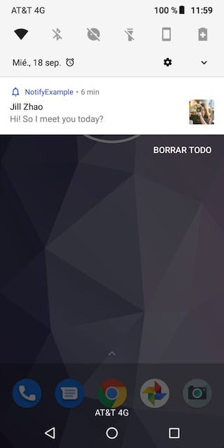

# Notify-Android
[](https://jitpack.io/#isradeleon/Notify-Android)
[](https://android-arsenal.com/api?level=19#l19)
[](https://android-arsenal.com/api?level=28#l19)

Android library that simplifies creating & showing app notifications. Change the notification's icon or add a circular image or a picture to the notification using the Notify class.

<p align="center">
    
    
</p>

## Installation

Add jitpack.io to your root build.gradle:
```gradle
allprojects {
    repositories {
        ...
        maven { url 'https://jitpack.io' }
    }
}
```

Include the dependency in your app build.gradle:
```gradle
dependencies {
    implementation 'com.github.isradeleon:Notify-Android:1.0.5' // updated for Android X
}
```

## Notification channel for API >= 26

You may need to add the default notification channel to your app/res/values/strings.xml file:
```xml
<resources>

    <string translatable="false" name="notify_channel_id">MyDefaultChannelID</string>

    <string translatable="false" name="notify_channel_name">MyDefaultChannelName</string>

    <string translatable="false" name="notify_channel_description">MyDefaultChannelDescription</string>

</resources>
```

## Basic usage

```java
@Override
protected void onCreate(Bundle savedInstanceState) {

    Notify.build(getApplicationContext())

        /*
         * Set notification title and content
         * */
        .setTitle("Jill Zhao")
        .setContent("Hi! So I meet you today?")

        /*
         * Set small icon from drawable resource
         * */
        .setSmallIcon(R.drawable.ic_notifications_none_white_24dp)
        .setColor(R.color.colorPrimary)

        /*
         * Set notification large icon from drawable resource or URL
         * (make sure you added INTERNET permission to AndroidManifest.xml)
         * */
        .setLargeIcon("https://images.pexels.com/photos/139829/pexels-photo-139829.jpeg?auto=compress&cs=tinysrgb&dpr=2&h=150&w=440")

        /*
         * Circular large icon
         * */
        .largeCircularIcon()

        /*
         * Add a picture from drawable resource or URL
         * (INTERNET permission needs to be added to AndroidManifest.xml)
         * */
        .setPicture("https://images.pexels.com/photos/1058683/pexels-photo-1058683.jpeg?auto=compress&cs=tinysrgb&dpr=2&h=650&w=940")

        .show(); // Show notification
}
```

## Methods

| Method | Description |
|------------------------------------|--------------------------|
| **Notify.build(context)** | Create a Notify object |
| **setId(id)** | Set the identifier for the notification |
| **setTitle(title)** | Set the notification title |
| **setContent(content)** | Set the notification content |
| **setImportance(importance)** | Handle the importance with NotifyImportance |
| **setLargeIcon(largeIcon)** | Set the large icon from a drawable or URL resource |
| **largeCircularIcon()** | Make large icon circular |
| **setSmallIcon(smallIcon)** | Set the small icon from a drawable resource |
| **setPicture(picture)** | Set a picture from a drawable or URL resource |
| **setChannelId(id)** | Set the notification channel id |
| **setChannelName(name)** | Set the notification channel name |
| **setChannelDescription(description)** | Set the notification channel description |
| **setAutoCancel(autoCancel)** | Set the auto-cancel value |
| **setAction(intent)** | Set the action for when user clicks the notification  |
| **enableVibration(vibration)** | Enable or disable the vibration |
| **setVibrationPattern(vibrationPattern)** | Set the vibration pattern |
| **getNotificationBuilder()** | Return the native NotificationCompat.Builder object |
| **show()** | Show the notification |
| **cancel(context, id)** | Cancel the specified notification by id |
| **cancelAll(context)** | Cancel all notifications |

## License

This library is licensed under `MIT license`. View [license](LICENSE).